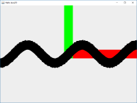
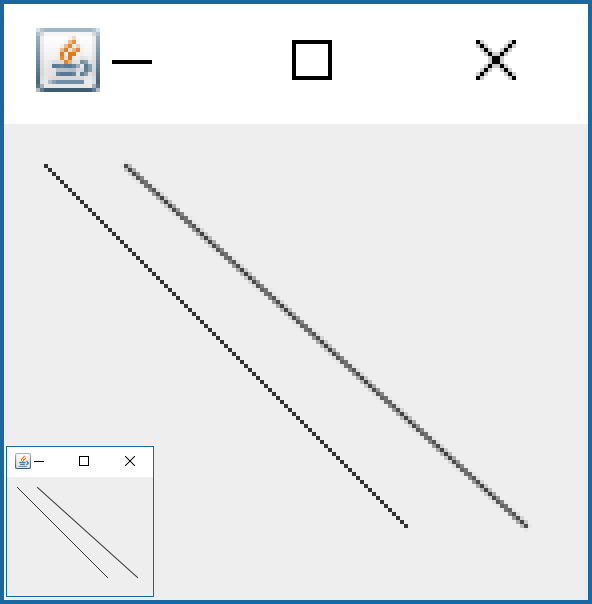
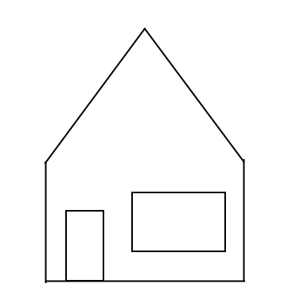
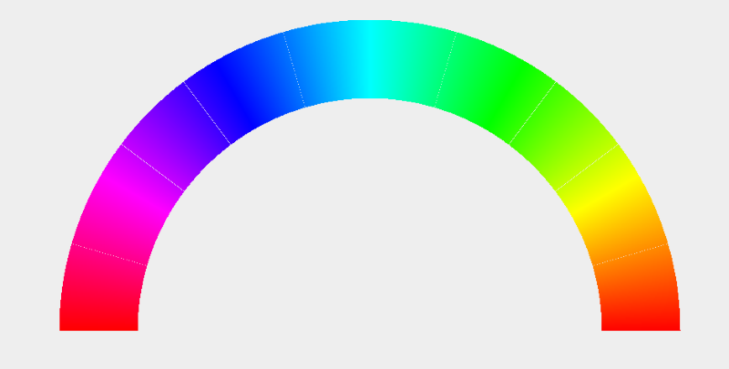
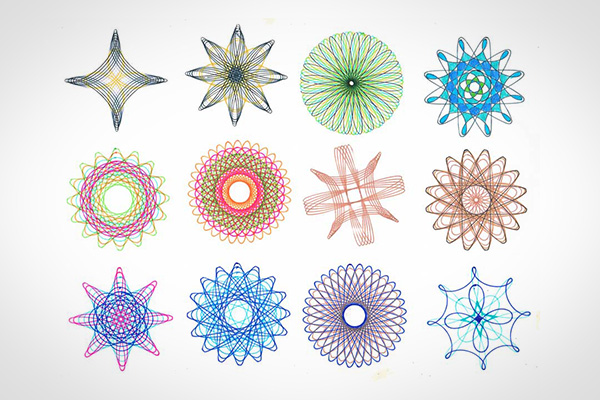

# Week 1
<!-- TOC -->

- [Week 1](#week-1)
- [Java2D](#java2d)
    - [Makkelijk gebruiken](#makkelijk-gebruiken)
    - [Lijnen](#lijnen)
    - [Kleuren](#kleuren)
    - [Transformaties](#transformaties)
    - [Combineren van transformaties](#combineren-van-transformaties)
    - [Parametrische vergelijkingen](#parametrische-vergelijkingen)
    - [Kwaliteit](#kwaliteit)
    - [Opgaven](#opgaven)

<!-- /TOC -->

# Java2D

Java2D is een verzameling van klassen om binnen java met 2D graphics te werken. Deze API bestaat uit een aantal klassen in de java.awt.graphics namespace, en veel functionaliteiten zijn gemakkelijk te benaderen via de [Graphics2D](https://docs.oracle.com/javase/7/docs/api/java/awt/Graphics2D.html) klasse. Een Graphics2D object slaat intern een aantal attributen op die bepalen hoe getekend gaat worden, zoals welke kleur gebruikt gaat worden. Daarnaast is er een uitgebreide [Shape](https://docs.oracle.com/javase/7/docs/api/java/awt/Shape.html)-library die gebruikt kan worden om verschillende vormen te combineren. Deze lessen gaan dieper in op het gebruik van Java2D, maar er is online natuurlijk [ook veel te vinden](https://docs.oracle.com/javase/tutorial/2d/TOC.html). 

Er wordt gebruik gemaakt van Java2D in combinatie met Swing, maar de concepten die behandeld worden zijn ook gemakkelijk toe te passen binnen JavaFX. Daarnaast zijn deze concepten ook toepasbaar binnen andere omgevingen, zoals de SurfaceView binnen android, of het canvas binnen C#.net

Alle code voor deze week kun je vinden op [github](https://github.com/Borf/2DGraphics_demo/tree/master/Java2D_week1), in het Java2D_week1 project.

## Makkelijk gebruiken

Java2D is te gebruiken 	via een [Graphics2D](https://docs.oracle.com/javase/7/docs/api/java/awt/Graphics2D.html) object. Dit object komt intern uit java en Swing, en kan gebruikt worden om op verschillende dingen te tekenen, zoals een JPanel. Om op een JPanel te tekenen kunnen we de volgende code gebruiken:

```java
public class Java2DDemo extends JPanel
{
    public static void main(String[] args)
    {
        JFrame frame = new JFrame("Java2D");
        frame.setSize(800, 600);
        frame.setContentPane(new Java2DDemo());
        frame.setDefaultCloseOperation(JFrame.EXIT_ON_CLOSE);
        frame.setVisible(true);
    }

    Java2DDemo()
    {
//init
    }

    public void paintComponent(Graphics g)
    {
        super.paintComponent(g);
        Graphics2D g2d = (Graphics2D)g;
//teken
    }
}
```

Deze code maakt een JFrame aan met een aantal standaard opties en zet hier een nieuw contentpaneel in. Dit contentpaneel is van het type Java2DDemo. Deze klasse override de paintComponent methode in deze methode kan code gezet worden om te tekenen. Door de super.paintComponent aan te roepen wordt de originele tekencode uitgevoerd voor het tekenen van andere componenten en wordt 't scherm leeggemaakt. Na deze methode aanroep kan code toegevoegd worden om eigen vormen te tekenen.

## Lijnen


Java2D werkt met een [Carthesisch Coördinatenstelsel](https://nl.wikipedia.org/wiki/Cartesisch_coördinatenstelsel). In het kort betekent dit dat er gebruik wordt gemaakt van een X- en een Y-as. De oorsprong van het coördinatenstelsel ligt standaard linksboven in het venster, waarbij de Y-as naar beneden loopt. Dit is dus gespiegeld ten opzichte van het wiskundige assenstelsel dat normaal gebruikt wordt om bijvoorbeeld grafieken te tekenen. Standaard is de eenheid een pixel, dit betekent dus dat punt (200,100) 200 pixels naar rechts, en 100 pixels naar beneden ligt ten opzichte van de linkerbovenhoek. Dit is een standaard die in veel grafische APIs gebruikt wordt.

Om een lijn te tekenen kan de ```draw()``` methode in het Graphics2D object gebruikt worden. Deze methode wil een Shape als parameter, een [Line2D](https://docs.oracle.com/javase/7/docs/api/java/awt/geom/Line2D.html) is een voorbeeld van een Shape. De Line2D klasse heeft geen public constructor, we zullen gebruik moeten maken van een van de subklassen van Line2D, zoals [Line2D.Double](https://docs.oracle.com/javase/7/docs/api/java/awt/geom/Line2D.Double.html). Deze kunnen we direct aan de draw methode meegeven, voor de volgende code.

```java
public class HelloLine extends JPanel
{
    public static void main(String[] args)
    {
        JFrame frame = new JFrame("Java2D");
        frame.setSize(800, 600);
        frame.setContentPane(new HelloLine());
        frame.setDefaultCloseOperation(JFrame.EXIT_ON_CLOSE);
        frame.setVisible(true);
    }

    Line2DDemo()
    {
    }

    public void paintComponent(Graphics g)
    {
        super.paintComponent(g);
        Graphics2D g2d = (Graphics2D)g;
        g2d.draw(new Line2D.Double(200, 100,    500, 200));
    }
}
```

Deze code zal een lijn tekenen van de coördinaat (200,100) naar (500,200).

## Kleuren

De Graphics klasse slaat op met welke kleur getekend gaat worden. Deze kleur kun je veranderen waarna alle opvolgende teken-commandos met deze kleur getekend zullen worden. De kleur kun je aanpassen met de setColor(Color color) methode. Kleuren kunnen op verschillende manieren aangemaakt worden via de [Color](https://docs.oracle.com/javase/7/docs/api/java/awt/Color.html) klasse:
- ```new Color(float r, float g, float b)```
  
  Maakt een kleur aan met rood, groen en blauw waarden. De parameters liggen tussen 0 en 1. ```new Color(1.0f, 1.0f, 1.0f)``` geeft dus een witte kleur.
- ```new Color(int r, int g, int b)``` 

  Maakt een kleur aan met rood, groen en blauw waarden. De parameters liggen tussen 0 en 255.
- ```Color.getHSBColor(float hue, float saturation, float brightness)``` 

  Maakt een kleur aan volgens het HSB model. Met de hue kun je een kleur instellen, de saturation is de kleurverzadiging en de brightness is de helderheid. De parameters liggen tussen 0 en 1, Color.getHSBColor(0.0f, 1.0f, 1.0f) geeft dus rood.
- ```Color.BLACK, Color.WHITE, Color.GREEN``` 

  Kleur-constanten zijn binnen java gedefinieerd als vaste basiskleuren die je gemakkelijk kunt gebruiken. De volledige lijst kun je vinden in [de java documentatie](https://docs.oracle.com/javase/7/docs/api/java/awt/Color.html#black). Let op dat de constanten altijd op twee manieren te benaderen zijn, het kan bijvoorbeeld door Color.BLACK en Color.black. Color.BLACK is later toegevoegd omdat Color.black niet aan de styleguide voldoet.

Door nu een kleur aan te maken en deze in het Graphics2D object te zetten, kun je bijvoorbeeld lijnen tekenen met deze kleur. Door steeds nieuwe kleuren te maken kunnen we verschillende lijnen tekenen met verschillende kleuren:

```java
import javax.swing.*;
import java.awt.*;

public class HelloColors extends JPanel {
    public static void main(String[] args)
    {
        JFrame frame = new JFrame("Hello Java2D");
        frame.setDefaultCloseOperation(WindowConstants.EXIT_ON_CLOSE);
        frame.setMinimumSize(new Dimension(800, 600));
        frame.setExtendedState(frame.getExtendedState() | JFrame.MAXIMIZED_BOTH);
        frame.setContentPane(new HelloColors());
        frame.setVisible(true);
    }

    public void paintComponent(Graphics g)
    {
        super.paintComponent(g);
        Graphics2D g2d = (Graphics2D)g;

        for(int i = 0; i < 500; i++) {
            g2d.setColor(Color.getHSBColor(i/500.0f, 1, 1));
            g2d.drawLine(i, 10, i, 100);
        }
    }
}
```

Deze code zal dus 500 lijnen tekenen, met ieder een andere kleur op basis van het HSB model. De hue verloopt hierbij van 0° tot 360°, waardoor je het hele kleurenspectrum te zien krijgt.

## Transformaties

Het standaard coördinatenstelsel in java2D heeft de oorsprong in de linkerbovenhoek van het scherm zitten, waarbij de Y-as naar beneden gaat. Soms is dit echter onhandig met het tekenen, en is het bijvoorbeeld handiger om dit assenstelsel aan te kunnen passen. Dit kan bij computer graphics met 3 verschillende acties.
- **Transleren**

  Transleren ofwel verplaatsen, verplaatst de oorsprong van het coördinatenstelsel. Dit kun je dus bijvoorbeeld gebruiken om de oorsprong op het centrum van het venster te leggen. We kunnen dit doen met de ```translate(double x, double y)``` methode in het Graphics2D object. Door ```g2d.translate(100,100);``` uit te voeren, verplaatsen we de oorsprong naar de pixel-coördinaat (100,100) in het venster. Met ```g2d.translate(getWidth()/2, getHeight()/2);``` kunnen we de hoogte en breedte van het paneel opvragen, en komt de oorsprong in het midden van het venster te liggen.

- **Roteren**

  Rotatie draait het coördinatenstelsel rond de oorsprong, of een ander punt. Dit doen we met de ```rotate(double hoek)``` methode (deze draait om de oorsprong) of de ```rotate(double hoek, double x, double y)``` methode (deze draait om een punt). Het is voor deze methoden dus erg belangrijk waar de oorsprong van het coördinatenstelsel ligt.
- **Schalen**

  Schalen vergroot of verkleint het coordinatenstelsel vanuit de oorsprong. Dit doen we met de [```scale(double x, double y)```](https://docs.oracle.com/javase/7/docs/api/java/awt/Graphics2D.html#scale(double,%20double)) methode. De x en y parameters zijn hierbij vermenigvuldigings-schaalfactoren. Een factor 1 zal de coördinaten hetzelfde houden en een factor 2 maakt de wereld 2× zo groot. Een schalingsfactor van 0 zal deze as compleet 'uitzetten' en een factor van -1 zal de as spiegelen. 

## Combineren van transformaties

Door verschillende transformaties achter elkaar uit te voeren kunnen we deze transformaties combineren. Hierbij is de volgorde van groot belang. Het is bijvoorbeeld belangrijk om eerst de oorsprong goed te zetten, voordat om de oorsprong gedraaid wordt. Door de wiskunde achter het combineren van deze transformaties (Zie volgende week), staan deze transformaties in de omgedraaide volgorde. Je moet de regels code dus van onder lezen. Om bijvoorbeeld de oorsprong van het coördinatenstelsel in het midden van het venster te zetten en de Y-as om te draaien zodat Y positief omhoog gaat, kunnen we de volgende code gebruiken:
```
g2d.translate(getWidth()/2, getHeight()/2);
g2d.scale(1,-1);
```

## Parametrische vergelijkingen

Een van de dingen die we met lijnen kunnen maken zijn grafieken en parametrische vergelijkingen. Een simpele grafiek zou bijvoorbeeld kunnen zijn ```y = sin(x)```. Deze grafiek kunnen we tekenen door een x-variabele te laten lopen, en hierbij de y-coördinaat te berekenen. Hierna zetten we een puntje op locatie x,y. Het probleem hierbij is echter, dat de waarden voor y tussen -1 en 1 liggen. Hiervoor moeten we dus gaan schalen. Daarnaast is het mooier om de continuïteit van de grafiek te tekenen door lijnen te tekenen tussen het huidige punt en het vorige punt. Hierdoor krijgen we 1 lijn. Hiervoor kunnen we de volgende code gebruiken:

```java
public void paintComponent(Graphics g)
{
    super.paintComponent(g);
    Graphics2D g2d = (Graphics2D)g;

    g2d.translate(getWidth()/2, getHeight()/2);
    g2d.scale( 50, -50);

    g2d.setColor(Color.red);
    g2d.drawLine(0,0,1000,0);
    g2d.setColor(Color.green);
    g2d.drawLine(0,0,0,1000);
    g2d.setColor(Color.black);

    double resolution = 0.1;
    double lastY = Math.sin(-10);

    for(double x = -10; x < 10; x += resolution)
    {
        float y = (float)Math.sin(x);
        g2d.draw(new Line2D.Double(x, y, x-resolution, lastY));
        lastY = y;
    }
}
```

[](les1/scaleproblem.png?right)

Deze code schaalt het scherm met een factor 50, tekent een assenstelsel, en maakt hierna de grafiek y = sin(x), waarbij x van -10 tot 10 loopt. Bij het uitvoeren van deze code, zien we echter een probleem ontstaan, de lijnen zijn ook opgeschaald en erg dik geworden.  Dit is op 2 manieren op te lossen; door de lijndikte kleiner te maken tot 1/50, of door de schaling niet te doen met de scale methode maar door alleen de coördinaten te vermenigvuldigen met een schalingsfactor. De tweede manier heeft in dit geval de voorkeur. Dit levert de volgende code op:

```java
public void paintComponent(Graphics g)
{
    super.paintComponent(g);
    Graphics2D g2d = (Graphics2D)g;

    g2d.translate(getWidth()/2, getHeight()/2);
    g2d.scale( 1, -1);

    g2d.setColor(Color.red);
    g2d.drawLine(0,0,1000,0);
    g2d.setColor(Color.green);
    g2d.drawLine(0,0,0,1000);
    g2d.setColor(Color.black);

    double resolution = 0.1;
    double scale = 50.0;
    double lastY = Math.sin(-10);

    for(double x = -10; x < 10; x += resolution)
    {
        float y = (float)Math.sin(x);
        g2d.draw(new Line2D.Double(x*scale, y*scale, (x-resolution)*scale, lastY*scale));
        lastY = y;
    }
}
```

Let hierbij op dat de schaling pas bij het tekenen toegepast wordt, niet al in de berekeningen. Nu krijgen we wel het gewenste resultaat. Het is nu triviaal om de schaal aan te passen, of een andere formule te gebruiken. Let wel op de resolution variabele, deze geeft de tussenstap tussen pixels aan. Als deze te klein is, wordt het tekenen erg langzaam, te groot en de grafiek berekent niet voor iedere pixel een juiste coördinaat

## Kwaliteit



Om de kwaliteit van lijnen te verbeteren kan anti-aliasing aangezet worden. [Anti-aliasing](https://nl.wikipedia.org/wiki/Anti-aliasing) is een techniek om kartelranden te voorkomen bij het tekenen van scheve objecten zoals lijnen. Anti-aliasing kan aangezet worden binnen het Graphics2D object en kan ook uitgezet worden indien het niet nodig is. Anti-aliasing zorgt voor een beter ogend resultaat, maar gaat wel ten koste van performance omdat het renderen langzamer gaat.

```java
public void paintComponent(Graphics g)
{
    super.paintComponent(g);
    Graphics2D g2d = (Graphics2D)g;

    g2d.setRenderingHint(RenderingHints.KEY_ANTIALIASING, RenderingHints.VALUE_ANTIALIAS_OFF);
    g2d.drawLine(10,10,100,100);

    g2d.setRenderingHint(RenderingHints.KEY_ANTIALIASING, RenderingHints.VALUE_ANTIALIAS_ON);
    g2d.drawLine(30,10,130,100);
}
```

## Opgaven
We gaan deze periode met IntelliJ werken. Maak voor iedere week een project met submodulen voor iedere opgave. Hiernaast is het gemakkelijk een template-project te gebruiken. De code voor een template vind je in het hoofdstuk [Makkelijk Gebruiken](#makkelijk-gebruiken).

1. Schrijf een programma dat een huis tekent. Het huis bestaat uit een basis met een puntdak, en een deur. Dit is een lijntekening en is dus een simpele vorm, zoals: 

2. Schrijf een programma dat de grafiek Y = X³ tekent. Let op de schaalverdeling van de assen, en zorg dat de grafiek goed in beeld te zien is. Het kan in dit geval verstandig zijn om de schaalverdeling op de X en Y as anders te nemen.

3. Schrijf een programma dat een spiraal tekent. Voor een spiraal kun je de formules gebruiken in het [poolcoördinaten-stelsel](https://nl.wikipedia.org/wiki/Poolcoördinaten). Door de formule `Ø = n × r` te gebruiken, krijg je een spiraalfiguur. hierin is n een constante de afstand tussen de spiraal aan te passen, en r de afstand tussen de oorsprong en het punt. Je kunt bijvoorbeeld n = 1 voor nemen. Om hierna van poolcoördinaten naar carthesische te gaan kun je de sinus en cosinus gebruiken:

  ```math
  x = r × cos(Ø)
  y = r × sin(Ø)
  ```
  De formule `Ø = n × r` omgeschreven wordt dus
  ```math
  x = n × Ø × cos(Ø)
  y = n × Ø × sin(Ø)
  ```
  waarbij n gebruikt kan worden om de dichtheid van de spiraal in te stellen

4. Schrijf een applicatie die een regenboog tekent, waar aan de linkerkant van de regenboog rood zit, en de rechterkant ook weer rood, met alle kleuren van het hue-spectrum ertussenin. Het is niet heel erg als er witte lijnen tussen sommige van de segmenten zitten. Je kunt de lijnen tekenen door de punten op een cirkel te berekenen. Deze punten kun je met dezelfde formules berekenen als bij opgave 3, maar met een andere straal.

  

5. 

    Een spirograaf is een instrument dat gebruikt kan worden om patronen te tekenen. Het werkt door een tandwiel dat binnen een ander tandwiel draait. Voor meer informatie zie [spirograaf](https://nl.wikipedia.org/wiki/Spirograaf).

    Maak een java-applicatie om verschillende spirograaf figuren te tekenen. Dit is eigenlijk vergelijkbaar met een parametrische vergelijking.

    Voor inspiratie, zie ook [nathanfriend.io/inspirograph/](http://nathanfriend.io/inspirograph/). Het gaat dus niet om de animatie, maar alleen om de uiteindelijke figuur. Zorg dat je applicatie configureerbaar is om verschillende (of misschien zelfs willekeurige) figuren te tekenen. Maak ook gebruik van kleuren.

    Voor het tekenen van de spirograaf kun je gebruik maken van de generieke formules

    ```math
    x = a × cos(b × ø) + c × cos(d × ø)
    y = a × sin(b × ø) + c × cos(d × ø)
    ```

    Dit zijn versimpelde formules, op wikipedia staan net iets andere formules, deze kun je ook gebruiken maar zijn iets complexer om te implementeren, maar wel gemakkelijker te configureren. Door de variabelen a,b,c en d aan te passen kun je een andere figuur te maken.
