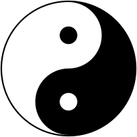

---
layout: default
title: Week 2
---
# Week 2

<!-- TOC -->

- [Week 2](#week-2)
    - [Shapes](#shapes)
    - [Paths](#paths)
    - [Areas en Constructive Solid Geometry](#areas-en-constructive-solid-geometry)
        - [Vereniging (add)](#vereniging-add)
        - [Verschil (subtract)](#verschil-subtract)
        - [Doorsnede (intersect)](#doorsnede-intersect)
        - [Exclusieve of (xor)](#exclusieve-of-xor)
        - [Gebruik van CSG](#gebruik-van-csg)
    - [Strokes](#strokes)
    - [Paints](#paints)
        - [Color](#color)
        - [GradientPaint](#gradientpaint)
        - [LinearGradientPaint](#lineargradientpaint)
        - [RadialGradientPaint](#radialgradientpaint)
        - [TexturePaint](#texturepaint)
            - [Textures inladen in IntelliJ](#textures-inladen-in-intellij)
    - [Transformeren van shapes](#transformeren-van-shapes)
        - [Gebruiken van transformaties - Shape transformeren](#gebruiken-van-transformaties---shape-transformeren)
        - [Gebruiken van transformaties - Camera](#gebruiken-van-transformaties---camera)
        - [Gebruiken van transformaties - Inverse](#gebruiken-van-transformaties---inverse)
    - [Muisinteractie](#muisinteractie)
    - [Opgaven](#opgaven)

<!-- /TOC -->

## Opgaven

1. Maak een programma die een maan tekent door middel van een generalpath en door middel van CSG.

2. Maak een applicatie die het ying-yang symbool tekent door middel van een generalpath en door middel van CSG.

3. Teken een programma dat 13 vierkanten naast elkaar tekent met alle kleuren die standaard in java zitten: black, blue, cyan, darkGray, gray, green, lightGray, magenta, orange, pink, red, white, yellow.
4. Teken een programma dat een rechthoek tekent over het gehele scherm met een RadialGradientPaint. Kies hier zelf een aantal kleuren voor uit, maar leg het centrum van de RadialPaint in het midden van het scherm (met getWidth()/2 en getHeight()/2). Voeg hierna een mousemotion listener toe, en leg het focuspunt van de RadialPaint op de locatie van de muis.
5. Maak een applicatie die een assenstelsel tekent, de lijn Y = 2.5 × X, en een vierkant van 100x100 met het middelpunt op (0, 150). Teken hierna dit vierkant, maar dan gespiegeld over de lijn Y = 2.5 × X. Voor spiegelen kun je de matrix [] gebruiken.
6. Maak een applicatie om blokken te slepen. Let erop dat als je een blokje sleept, het blokje niet verspringt.

    Om dit programma te maken, kun je het beste een nieuwe klasse maken zoals de Renderable klasse, waarin je de kleur, positie en shape van het blokje opslaat. Deze objecten sla je in een list op in de constructor, en in de paintComponent methode teken je deze. In de mousePressed, mouseDragged methode deze array te inspecteren en te manipuleren kun je de blokken verplaatsen

    **Uitdaging:** Voeg een camerasysteem toe. Door met de rechtermuisknop te slepen kun je het complete scherm verslepen, met het scrollwieltje kun je de camera inzoomen en uitzoomen, en met de linker muisknop kun je een blok verslepen. Daarnaast moet het slepen natuurlijk ook werken als de camera verschoven of ingezoomed is. Let erop dat het 't gemakkelijkst is om de camerapositie en zoom los op te slaan, en iedere keer dat getekend wordt de cameraAffineTransform te berekenen.