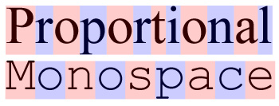

<style>
img[src$="right"] {
  display:block;
  float: right;
}
</style>
# Week 3

<!-- TOC -->

- [Week 3](#week-3)
    - [Tekst](#tekst)
    - [Afbeeldingen](#afbeeldingen)
        - [SpriteSheets](#spritesheets)
    - [Blending](#blending)
    - [Clipping](#clipping)
    - [Animeren met timers](#animeren-met-timers)

<!-- /TOC -->

## Tekst

We kunnen tekst op 't scherm zetten met de [```drawString(String text, float x, float y)```](https://docs.oracle.com/javase/7/docs/api/java/awt/Graphics2D.html#drawString(java.lang.String,%20float,%20float)) methode. Deze methode zal een tekst tekenen op de aangegeven positie, met de transformatie die op dat moment in het Graphics2D object staat opgeslagen. Daarnaast kunnen we een lettertype instellen met de [```setFont(Font font)```](https://docs.oracle.com/javase/7/docs/api/java/awt/Graphics.html#setFont(java.awt.Font)) methode. In dit font object staan de eigenschappen van het lettertype opgeslagen, zoals welk lettertype dit is, de afmetingen, de styling (_bold_, *italic*).

Omdat de geïnstalleerde lettertypen op iedere computer anders zijn, heeft java een aantal standaard lettertypen gedefinieerd.

- Serif
- SansSerif
- Monospaced
- Dialog
- Dialoginput



De standaard lettertypen die gebruikt worden zijn Proportional. Dit betekent dat alle letters een andere breedte hebben, en ook een eigen ruimte hebben tussen een letter en opvolgende letters. Dit leest prettiger voor gewone teksten. Voor sommige zaken, zoals code, is het prettiger een MonoSpaced font te gebruiken. In deze lettertypen zijn alle letters even breed, en hebben altijd dezelfde tussenruimte (tussen het begin van de letters). Hierdoor lijnt tekst beter uit.


Serifs (Nederlands: [Schreef](https://nl.wikipedia.org/wiki/Schreef)), zijn de uitstekende stukjes in een lettertype. Door gebruik te maken van een serif, krijgt een lettertype meer variatie, waardoor het gemakkelijker te herkennen is. Lettertypen met serif worden vooral gebruikt bij gedrukte tekst. Op een beeldscherm wordt meestal gebruik gemaakt van lettertypen zonder serif, omdat er bij de omzetting naar pixels maar een beperkt aantal pixels beschikbaar zijn, wat er voor zorgt dat de serif vaak erg klein zijn en afleiden van de rest van de letter.

Om een font te maken kan gebruik worden gemaakt van de [```Font(String name, int style, int size)```](https://docs.oracle.com/javase/7/docs/api/java/awt/Font.html#Font(java.lang.String,%20int,%20int)) constructor. De naam kan de naam van een lettertype op de PC zijn, maar kan ook een van de standaard java-lettertypen zijn (Serif, SansSerif, Monospaced, Dialog, Dialoginput). Deze namen staan ook opgeslagen in de Font-klasse, als Font.DIALOG, Font.MONOSPACED etc. De style geeft de stijl van het lettertype aan:

- Font.PLAIN
- Font.BOLD
- Font.ITALIC
- Font.BOLD | Font.ITALIC

Daarnaast is het mogelijk om direct een TrueType font in te laden uit een bestand (dat je bijvoorbeeld mee kunt leveren met je applicatie), met de statische createFont methode:

```java
Font font = Font.createFont(Font.TRUETYPE_FONT, new File("A.ttf"));
```

Ook is het mogelijk om een lettertype af te leiden van een bestaand, ingeladen lettertype. Dit doe je met de [```Font.deriveFont()```](https://docs.oracle.com/javase/7/docs/api/java/awt/Font.html#deriveFont(float)) methoden. Met de verschillende deriveFont methoden kunnen de afmetingen, stijl of zelfs een complete transformatie op een font veranderd worden.

Om nu meer te kunnen doen met fonts, kunnen we deze ook omzetten naar een Shape, zodat we deze kunnen gebruiken met de fill en draw methoden. Iedere tekst zal dan dus wel een eigen Shape-object krijgen, dus dit is niet erg handig in gebruik van dynamische teksten. Met de volgende code kunnen we bijvoorbeeld een outline tekenen

```java
public void paintComponent(Graphics g)
{
    super.paintComponent(g);
    Graphics2D g2d = (Graphics2D)g;

    Font f = new Font("Arial", Font.PLAIN, 30);
    Shape shape = font.createGlyphVector(g2d.getFontRenderContext(), "Hello World");
    g2d.draw(shape);
    g2d.draw(AffineTransform.getTranslateInstance(100,100).createTransformedShape(shape));
}

```

Door nu voor iedere letter een shape te maken, kunnen nog geavanceerdere teksteffecten bereikt worden, zoals het individueel verkleuren van letters tot het tekenen van tekst in een boog

## Afbeeldingen
De [Image](https://docs.oracle.com/javase/7/docs/api/java/awt/Image.html) klasse, is een abstracte klasse om met afbeeldingen te werken. Deze kun je echter niet zomaar aanmaken, omdat deze abstract is. Je kunt een afbeelding op 2 manieren aanmaken, uit een bestand inladen of een nieuwe lege afbeelding maken. Om een afbeelding in te laden vanuit een bestand en te tekenen, kunnen we de volgende code gebruiken:

```java
class HelloImage extends JPanel
{
    private BufferedImage image;
    public HelloImage()
    {
        try {
            image = ImageIO.read(getClass().getResource("/images/test.png"));
        }
    }

    public void paintComponent(Graphics g)
    {
        super.paintComponent(g);
        Graphics2D g2d = (Graphics2D)g;

        AffineTransform tx = new AffineTransform();
        tx.translate(400,400);
        tx.rotate(Math.toRadians(45.0f), image.getWidth()/2, image.getHeight()/2);
        tx.scale(0.75f, 0.75f);
        g2d.drawImage(image, tx, null);
    }
}
```

Op deze manier wordt een afbeelding maar 1x ingeladen (in de constructor), en steeds herbruikt met het tekenen.

### SpriteSheets

In games worden veel spritesheets gebruikt om animaties of meerdere gelijksoortige afbeeldingen op te slaan. Dit zijn afbeeldingen met meerdere kleine afbeeldingen erop 


Deze afbeeldingen kun je gemakkelijk opknippen

## Blending

## Clipping

## Animeren met timers