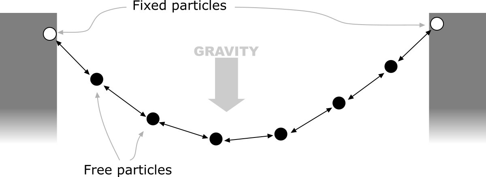
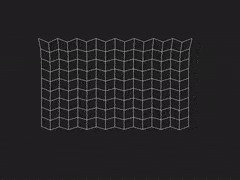
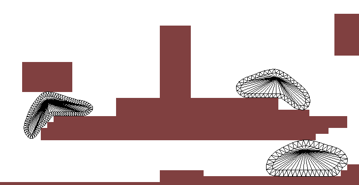
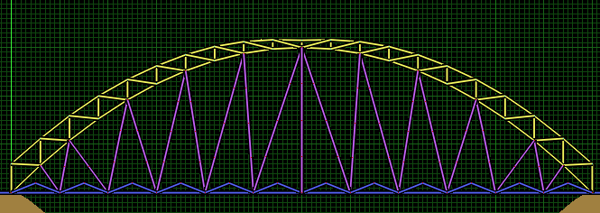

# Week 4

---
# Verlet Particles

Vorige les is aan bod geweest hoe Java2D gebruikt kan worden om te animeren. Een ArrayList kan gebruikt worden om punten op te slaan, de zogenaamde particles, om animaties en speciale effecten te maken.

Om een bewegend punt op te slaan, kan dit gemodelleerd worden met een locatie, snelheid en versnelling. Om dit punt een tijdstap verder te zetten, kan de volgende code gebruikt worden:

```java
public class Particle {
    private Point2D position;
    private Point2D speed;
    private Point2D acceleration;

    public Particle(Point2D position) {
        this.position = position;
        this.speed = new Point2D.Double(0,0);
        this.acceleration = new Point2D.Double(0,-9.8); // gravity
    }

    public void update() {
        this.position = new Point2D.Double(position.getX() + speed.getX(), position.getY() + speed.getY());
        this.speed = new Point2D.Double(speed.getX() + acceleration.getX(), speed.getY() + acceleration.getY());
    }

    public void draw(FXGraphics2D g2d) {
        g2d.fill(new Ellipse2D.Double(position.getX()-5, position.getY()-5, 10, 10));
    }
}
```

## Animeren

Door nu iedere keer dat de timer tikt de update aan te roepen, zal het punt in een animatie naar beneden vallen. Door nu een lijst van particles te maken, en de update en draw methoden correct aan te roepen worden meerdere particles geanimeerd en op het scherm getekend.

```java
public class VerletDemo extends Application {

    private Stage stage;
    private ArrayList<Particle> particles = new ArrayList<>();

    @Override
    public void start(Stage primaryStage) throws Exception {
        stage = primaryStage;
        Canvas canvas = new Canvas(1920, 1080);
        FXGraphics2D g2d = new FXGraphics2D(canvas.getGraphicsContext2D());
        draw(g2d);
        primaryStage.setScene(new Scene(new Group(canvas)));
        primaryStage.setTitle("Hello Verlet");
        primaryStage.show();

        new AnimationTimer() {
            long last = -1;
            @Override
            public void handle(long now) {
                if(last == -1)
                    last = now;
                update((now - last) / 1.0e9);
                last = now;
                draw(g2d);
            }
        }.start();

    }

    public void init() {
        particles.add(new Particle(100,100));
    }

    public void update(double deltaTime) {
        for(Particle p : particles)
            p.update();
    }

    public void draw(FXGraphics2D g2d) {
        g2d.setColor(Color.white);
        g2d.clearRect(0,0, 1920, 1080);

        for(Particle p : particles)
            p.draw(g);
    }
}
```

## Verlet integratie

Deze code zal een particle aanmaken, updaten en tekenen, met de mogelijkheid om er meer te tekenen. Deze voorstelling werkt goed voor simpele particles, maar het is nu erg lastig om direct het gedrag te beïnvloeden. Als een particle stilgezet wordt of verplaatst wordt vanuit de gebruikerscode, moet ook de snelheid opnieuw berekend worden, en past ook de acceleratie aan. De snelheid kan ook geïntegreerd worden, waardoor de positie en vorige positie opgeslagen wordt. De snelheid is dan gelijk aan de (huidige positie - vorige positie). De volgende code vat dit samen:

```java
public class Particle {
    private Point2D position;
    private Point2D lastPosition;
    private Point2D acceleration;
    private double size;

    public Particle(Point2D position) {
        this.position = position;
        this.lastPosition = position;
        this.acceleration = new Point2D.Double(0,-9.8); // gravity
        this.size = 10;
    }

    public void update() {
        Point2D old = position;
        position = new Point2D.Double(
                position.getX() + (position.getX() - lastPosition.getX()) + force.getX(),
                position.getY() + (position.getY() - lastPosition.getY()) + force.getY()
        );
        lastPosition = old;
    }

    public void setPosition(Point2D position) {
        this.position = position;
    }

    public void draw(FXGraphics2D g2d) {
        g2d.fill(new Ellipse2D.Double(position.getX()-size/2, position.getY()-size/2, size, size));
    }
}
```

Let hierbij op dat de positie eerst opgeslagen wordt voordat deze veranderd wordt, omdat deze nog in de lastPosition gezet moet worden. Als we nu de positie aanpassen, veranderd de snelheid impliciet mee. Dit zorgt ervoor dat objecten in beweging blijven, en netjes stoppen als ze botsen. We kunnen nu simpele restricties gaan inbouwen om de particles binnen het scherm te houden. Dit doen we door de randen van het scherm te vergelijken met de positie van de particle, en als de particle buiten het scherm valt, de positie op de rand te zetten.

## Constraints


 Door nu code toe te voegen om de punten te beïnvloeden kunnen bepaalde effecten gecreëerd worden. Twee voorbeelden van dit soort invloeden zijn het vastzetten van een punt op een vaste locatie en het op een vaste afstand te houden van twee punten. Deze twee beperkingen kunnen samengevat worden in een Constraint, waar subklassen van gemaakt worden die constraints voorstellen.

```java
public interface Constraint {
    void satisfy();
    void draw(FXGraphics2D g2d);
}
```

Een constraint om een punt op een vast punt te houden is nu bijvoorbeeld:

```java
public class StaticConstraint implements Constraint {
    private Point2D position;
    private Particle particle;

    public StaticConstraint(Particle particle) {
        this.position = particle.getPosition();
        this.particle = particle;
    }

    public void satisfy() {
        particle.setPosition(position);
    }

    public void draw(FXGraphics2D g2d) {

    }
}
```

De satisfy methode zal de particle op een vaste plek zetten. Door deze nu aan te roepen nadat alle particles geupdate zijn, blijft de particle op de juiste plek staan.

Een ander soort constraint is een vaste-afstand constraint. Deze constraint zorgt ervoor dat twee punten altijd op dezelfde afstand blijven. Als punten te ver van elkaar vandaan staan, worden ze naar elkaar toe verplaatst en wanneer ze te dicht op elkaar staan worden ze naar buiten verplaatst. Door een vaste afstand in te stellen en de echte afstand te berekenen, kan het verschil hiertussen berekend worden. Hierna kan je de verschilvector van de twee punten nemen, deze normaliseren en de helft van het verschil met deze vector vermenigvuldigen, en dit bij het ene punt optellen, en van het andere punt afhalen.

In de afbeelding hiernaast: bekend is punt A en B, dit zijn de posities van de twee particles in de constraint. De bedoeling na de update is om deze op posities C en D zetten. Om A op positie C te zetten, moet eerst de vector AC berekend worden.

- Verschil = *B - A*
- Genormaliseerd = *Verschil / lengte(Verschil)*
- Correctie = *(lengte(Verschil) - gewensteLengte) / 2*
- AC = *genormaliseerd * Correctie*
- C = *A + AC*

Hetzelfde kan berekend worden voor D en C. De waarde van CD is echter -AC, en hoeft dus niet opnieuw berekend te worden. Dit kan in de volgende code samengevat worden:

```java
public class DistanceConstraint implements Constraint {
    private Particle p1;
    private Particle p2;
    private double distance;

    public DistanceConstraint(Particle p1, Particle p2) {
        this.p1 = p1;
        this.p2 = p2;
        this.distance = p1.getPosition().distance(p2.getPosition());
    }

    public void satisfy() {
        Point2D a = p1.getPosition();
        Point2D b = p2.getPosition();

        Point2D diff = new Point2D.Double(b.getX() - a.getX(), b.getY() - a.getY());
        double length = a.distance(b);

        double correction = (length - distance) / 2;
        Point2D normalizedDiff = new Point2D.Double(diff.getX() / length, diff.getY() / length);

        p1.setPosition(new Point2D.Double(
                a.getX() + normalizedDiff.getX() * correction,
                a.getY() + normalizedDiff.getY() * correction));
        p2.setPosition(new Point2D.Double(
                b.getX() - normalizedDiff.getX() * correction,
                b.getY() - normalizedDiff.getY() * correction));
    }

    public void draw(FXGraphics2D g2d) {
        g2d.draw(new Line2D.Double(p1.getPosition(), p2.getPosition()));
    }
}
```

Deze constraint zal de afstand tussen twee particles nu goed zetten. Dit veroorzaakt nu ook dynamisch gedrag. Stel dat er drie punten op een lijn zijn, met een afstand van 50, en een gewenste afstand van 100, de locaties van de punten zijn: A (0,0), B (50,0) en C (100,0).

Allereerst corrigeert de distance constraint tussen punten A en B de afstand. Punt A komt hier dan op (-25,0) te liggen, punt B op (75,0). De afstand tussen deze twee punten is dan weer 100.

Hierna corrigeert de constraint tussen punten B en C op de afstand. De afstand tussen deze punten is nu 25, dus punt B komt nu op (37.5,0) te liggen, en punt C op (137.5,0). De afstand tussen punt B en C is nu 100, maar de afstand tussen A en B is ineens 62 geworden. De afstand was 50, en is nu 62, dus de afstand ligt nu wel dichter bij de gewenste afstand, 100. Hieronder staat een uiteenzetting van de gegevens na een aantal herhalingen:

| x(A)     | x(B)     | x(C)      | AB       |
|---------:|---------:|----------:|---------:|
| 0        | 50       | 100       | 50       |
| -25      | 37.5     | 137.5     | 62.5     |
| -43.75   | 46.875   | 146.875   | 90.625   |
| -48.4375 | 49.21875 | 149.21875 | 97.65625 |

Wat opvalt is dat de afstand tussen A en B met iedere iteratie dichter bij 100 komt, maar steeds weer 'teruggeduwd' wordt door de constraint tussen B en C. De volgorde van het oplossen van de constraints is dus van belang. De afstand komst wel steeds dichter bij de 100, en na een aantal stappen zal deze afstand nagenoeg 100 zijn. De constraints zijn dus niet stijf maar flexibel, de afstanden zijn niet altijd 100, maar na een aantal iteraties gaan ze wel dichter hiernaartoe. Ook bij het toevoegen van krachten (zoals zwaartekracht), zullen constraints niet altijd de juiste lengte hebben, maar wel duwen om deze kant op te gaan.

## Voorbeelden van gebruik van verlets

### Doeksimulatie



### Blob Physics



Een blob is te modelleren als een centrum met een buitenkant.

### Bridgebuilder



---



{: .exercises }

Einde van week 4