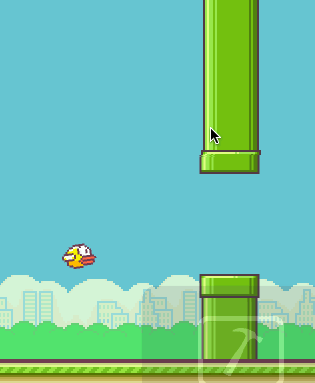

# Week 6

---
## Introductie



We gaan deze week een Flappy bird kloon maken. Flappy bird is een simpele game met een vogeltje dat door een stel buizen vliegt. Indien het vogeltje ergens tegenaan botst stopt het spel en moet de speler opnieuw beginnen. Het programmeren gaan we in een aantal losse onderdelen doen

- Inladen afbeeldingen tekenen van de achtergrond
- De vogel, tekenen en physics
- Tekenen en animeren van de buizen
- Collision detection

## Inladen afbeeldingen en tekenen achtergrond

[](images/week06/spritesheet.png))Voor flappy bird is het mogelijk een spritesheet te downloaden. Deze spritesheet bevat een flink aantal losse afbeeldingen, waar we een aantal van gaan gebruiken. We kunnen deze afbeeldingen uitknippen door de coördinaten op te zoeken in een imagetool, waar de volgende subafbeeldingen uit komen:

```java
BufferedImage total = ImageIO.read(getClass().getResource("/spritesheet.png"));
background = total.getSubimage(0,0, 144, 256);
bird = total.getSubimage(3, 491, 17, 12);
pipeUp = total.getSubimage(56, 323, 26, 160);
pipeDown = total.getSubimage(84, 323, 26, 160);
```

Deze objecten kunnen in attributen opgeslagen worden om in de paintComponent methode getekend te worden. De achtergrond is een herhalende achtergrond, hier kan een TexturePaint gebruikt worden. Om deze te laten scrollen, gebruiken we een attribuut om deze te animeren

```java
private float backgroundScroll = 0;

public void draw(FXGraphics2D g2d)
{
    double ratio = getHeight() / (double)getWidth();
    g2d.setPaint(new TexturePaint(background, new Rectangle2D.Double(-backgroundScroll,0,getWidth()*ratio, getHeight())));
    g2d.fill(new Rectangle2D.Double(0,0,getWidth(), getHeight()));
}

public void update(double deltaTime )
{
    backgroundScroll += 2;
}
```

Door de waarde van de backgroundScroll te animeren, kunnen we de achtergrond bewegen. Door de waarde 2 aan te passen, kan de snelheid van het scrollen aangepast worden.

## De vogel

De vogel in flappy bird beweegt via 'standaard physics' omhoog en naar beneden. De vogel heeft een positie en een snelheid, en door te tappen, klikken of op een knop te drukken, veranderd de snelheid om de vogel naar boven te laten vliegen. Dit kunnen we modelleren met 2 attributen, ```birdHeight``` = 10 en ```birdSpeed``` = 0. Deze twee attributen kunnen we animeren met de volgende code:

```java
birdheight += birdspeed;
birdspeed += 0.25;
```

De vogel kunnen we hierna tekenen met een AffineTransform. We laten de hoek van de vogel afhangen van de snelheid, als de vogel omhoog gaat (positieve snelheid) draait de vogel een stukje linksom, als de vogel omlaag gaat (negatieve snelheid) draait de vogel een stukje rechtsom.

```java
AffineTransform tx = new AffineTransform();
tx.translate(20, birdHeight);
tx.rotate(birdSpeed / 15, bird.getWidth()/2, bird.getHeight()/2);
tx.scale(2,2);
g2d.drawImage(bird, tx, null);
```

De snelheid wordt met een factor 15 gedeeld, om deze om te zetten naar een hoek. Door deze factor kleiner te maken (bijvoorbeeld 10), wordt de hoek extremer, door de factor groter te maken wordt de hoek kleiner.

## De obstakels

De obstakels zijn buizen die van rechts naar links door het scherm scrollen. Per obstakel moeten dus 2 floating-point variabelen opslagen worden, hoe ver is de buis gescrolled, en op welke hoogte het gat tussen de buizen zit. Deze 2 waarden kunnen in een losse klasse opgeslagen worden zoals

```java
class Pipe
{
    private float xposition;
    private float height;
}
```

Maar deze 2 cöordinaten kunnen ook in een Point2D opgeslagen worden. De x-waarde stelt dan de positie horizontaal voor, en de y-waarde stelt de hoogte van 't gat voor. Er kunnen meerdere buizen tegelijk op het scherm komen, dus deze worden in een ArrayList opgeslagen. Door een teller bij te houden kan na een bepaalde tijd een nieuwe buis toegevoegd worden. Deze buizen kunnen we hierna tekenen in de paintComponent, door de positie te berekenen

```java
private ArrayList<Point2D> pipes = new ArrayList<>();
private double pipeCounter = 0;
private final double gapSize = 100;


public void update(double elapsedTime)
{
    pipeCounter--;
    if(pipeCounter < 0)
    {
        //spawn pipe
        pipeCounter = 50 + 100 * Math.random();
    }

    for(Point2D pipe : pipes)
    {
        pipe.setLocation(pipe.getX()-3, pipe.getY());
    }
}

public void draw(FXGraphics2D g2d)
{
    for(Point2D pipe : pipes)
    {
        AffineTransform pipeTransform = new AffineTransform();
        pipeTransform.translate(pipe.getX(), pipe.getY() - gapSize - pipeUp.getHeight()*2);
        pipeTransform.scale(2,2);
        g2d.drawImage(pipeUp, pipeTransform, null);

        pipeTransform = new AffineTransform();
        pipeTransform.translate(pipe.getX(), pipe.getY() + gapSize);
        pipeTransform.scale(2,2);
        g2d.drawImage(pipeDown, pipeTransform, null);
    }
}
```

De afbeeldingen van de pijpen worden nu boven en onder de opgegeven posities getekend

## Collision


---

Einde van week 6